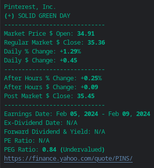

# finsou.py

The finsou.py CLI uses Python's html.parser + Beautiful Soup + regex to parse Yahoo stock price info.

**Example Stock Summary**

`python finsou.py -s PINS`



With it, you can:
- see market open, daily price action, market close and after hours summary for each stock in your terminal
- see a color coded report, green or red, based on the sum of regular market + after hours price moves
- see upcoming earnings date and ex-dividend date
- export price summaries queried to csv
- download earnings reports and media with urllib

**Caveats**
- After hours only. This tool only currently works after the market has closed normal market hours.
- After hours prices for "over the counter" (OTC) traded stocks are not listed on Yahoo.
- Fetching a stock report takes about 3 seconds. After about 50 stock requests, you might get throttled on the HTTP request and there is a substantial delay.
- Media is only downloaded if the investor website returns an HTML page. Sometimes, websites return Javascript. When this is the case, a browser or Selenium is required to render the HTML.

To learn more details about this project, read my blog post [here](https://lofipython.com/making-a-yahoo-stock-price-summary-cli-with-python).


**Install Python Library Dependencies**
```
pip install beautifulsoup4
pip install pandas
pip install requests
pip install rich
pip install tqdm
pip install yfinance
```

**CLI Options**

| Arg  | Alt. Arg  | Description										                         |
|-----:|-----------|-----------------------------------------------------------------------------|
|   -s | --stocks  | accepts stock ticker, comma delimited string of stocks or portfolio.txt     |
|   -c | --csv     | write csv summary to given file, ex: "csv_name.csv"                         |
|   -f | --fast| pass 1 to this flag to disable yfinance PEG lookup       |
|   -r | --research| accepts investor resources url, downloads PDF, docx, csv, xlsx + mp3        |
|   -h | --help    | show help message and exit  						                         |

**Examples**
```
# Summarize a list of stocks.
python finsou.py -s SPOT,DDOG,NET

# Write price summaries to csv.
python finsou.py --stocks TSLA,MSFT,AAPL --csv "Prices Summary.csv"

# Read a list of stocks from a text file with one ticker on each line.
python finsou.py -s portfolio.txt -c "Portfolio Prices.csv" --fast 1

# Scan investor relations site and download all media from urls.
python finsou.py -s KO -r https://investors.coca-colacompany.com/financial-information/financial-results
```


**Example portfolio.txt contents:**
```
META
PINS
SNAP
```

**Interpreting PEG Ratio**
- greater than 1 = Overvalued
- 0 to 1 = Undervalued
- negative PEG = Caution

> "A negative PEG ratio can mean one of two things:
either the P/E ratio of the stock is negative, meaning that the company is losing money,
or
the estimated growth rate for future earnings is negative,
indicating that the earnings of the company are expected to decrease in the future.
If the PEG ratio is negative because of a negative P/E ratio, it is generally
considered to be a bad sign. Negative earnings are an extremely risky place for
a business to be in, and the possible gains that could be made by gambling
on a comeback story usually aren’t enough to justify the enormous risk you
take by investing in this kind of situation.However, if a company’s growth is negative, it could be something you want to avoid, but it is not necessarily a bad sign.
The implications for a negative PEG ratio depend on the reason behind the negative PEG ratio."

\- Bing
